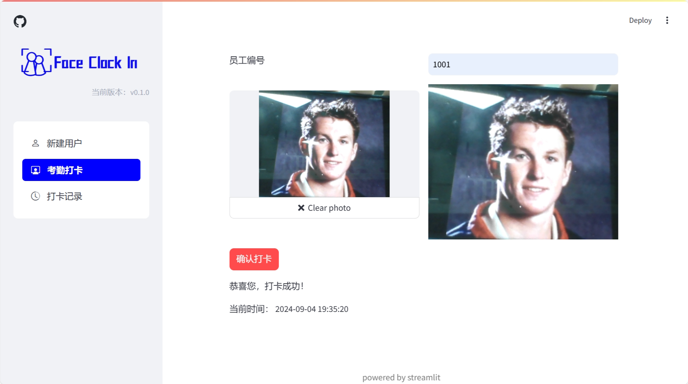

# Face Clock In

## 目录

* [概述](#概述)

* [快速上手](#快速上手)
  
  * [1.开发环境](#1.开发环境)
  
  * [2.环境配置](#2.环境配置)
  
  * [3.修改配置文件](#3.修改配置文件)
  
  * [4.数据库初始化](#4.数据库初始化)
  
  * [5.启动项目](#5.启动项目)

* [功能展示](#功能展示)
  
  * [主界面](#主界面)
  
  * [新建用户界面](#新建用户界面)
  
  * [考勤打卡界面](#考勤打卡界面)
  
  * [打卡记录界面](#打卡记录界面)
  
  * [数据库界面](#数据库界面)

## 概述

Face Clock In是一款基于Streamlit、OpenCV和psycopg2开发的人脸识别考勤远程打卡系统，部署简单，使用方便，采用纯Python语言编写。

该项目使用[Streamlit](https://github.com/streamlit/streamlit)进行开发，以WebUI的形式展示项目内容。人脸比对方面，采用了讯飞开放平台的人脸比对API接口。同时，数据存储方面使用了OpenGauss数据库。

备注：本项目选用了OpenGauss数据库，如果连接使用MySQL等其他数据库，可能会产生一些bug，这是因为OpenGauss数据库和其他数据库的SQL语句语法有细微的差距，后续版本也许会针对不同的数据库做适配。

## 快速上手

### 1.开发环境

1. 系统：Windows 11
2. 环境：Python 3.8，OpenGauss 5.0.2
3. 第三方包：Streamlit、OpenCV、psycopg2等，详见requrements.txt

### 2.环境配置

首先，确保你的机器安装了Python 3.8，并且可以正常连接到OpenGauss数据库。

接着拉取本项目的仓库。

```
git clone https://github.com/crandomame/Face_ClockIn.git
cd Face_ClockIn
```

直接使用pip安装依赖即可，推荐使用虚拟环境。

```
pip install -r requirements.txt
```

### 3.修改配置文件

打开setting.py文件，内容如下：

```
opengauss_config = {  
    'database': '',  # 选择数据库名称  
    'user': '',  # 连接数据库的用户名  
    'password': '',  # 连接数据库的用户密码  
    'host': '',  # 数据库ip  
    'port': '',  # 数据库服务器监听的端口号  
    'client_encoding': 'UTF-8'  
}  

SparkApi_config = {  
    'appid': '',  
    'apikey': '',  
    'apisecret': '',  
}
```

其中，opengauss_config即为连接OpenGauss数据库的配置信息，SparkApi_config为讯飞星火人脸比对API信息配置。讯飞星火人脸比对API可在讯飞开放平台免费获取，详见[控制台-讯飞开放平台 (xfyun.cn)](https://console.xfyun.cn/services/face_compare) 。

### 4.数据库初始化

运行database.py即可初始化数据库。

```
python database.py
```

初始化成功后可在命令行窗口看到数据库初始化成功的提示信息。

### 5.启动项目

在命令行中输入以下代码即可运行本项目，出现主界面即为启动成功。

```
streamlit run WebUI.py
```

## 功能展示

### 主界面


### 新建用户界面

人脸图片来自网络，侵权请联系作者删除。


### 考勤打卡界面

### 打卡记录界面

### 数据库界面

此处采用DataStudio与OpenGauss连接，以下分别为employee和history表格中信息。

employee表格


history表格


